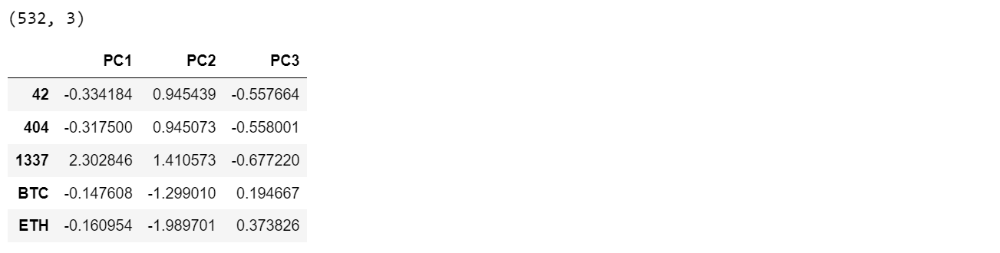
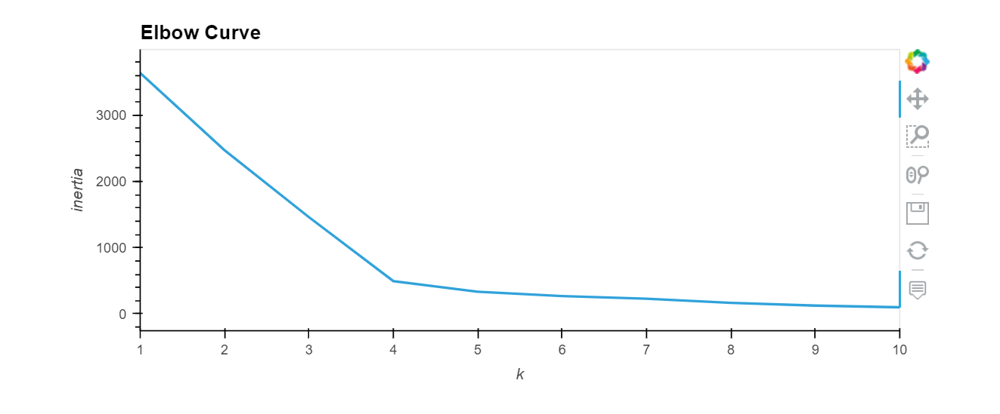
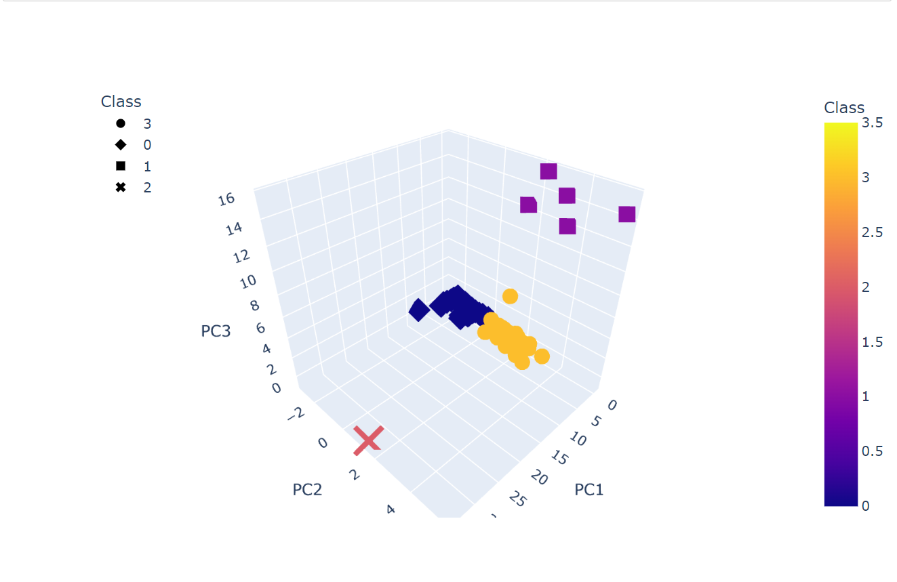
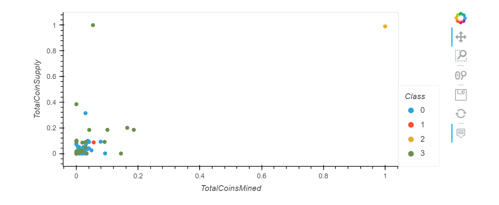

# Cryptocurrencies
**Use unsupervised machine learning to analyze cryptocurrencies.**

# Overview
The purpose of this analyisis is to create a report that includes what cryptocurrencies are on the trading market and how they could be grouped to create a classification system for new investments for the Advisory Services Team at Accountability Accounting.  The output is unknown, therefore the best method of anaylsis is *unsupervised machine learning* with clustering algorithms (KMean) and visualized with 2D and 3D scatter plots.

# Resources
Data Source:
* crypto_data.csv

Software:
* Python
* Conda
* Jupyter Notebook

Python Libraries: 
* Pandas
* hvplot
* path
* sklearn
    * StandardScaler
    * MinMaxScaler
    * PCA
    * KMeans

# Crypto Currencies Results

These are the steps of the analysis

## 1. Verify and Process the Data
The first step in the process is to verify and prepare the data including:
1. dropping null values
2. using only tradable and mined cryptocurrencies
3. numerically encoding categorical columns
4. scaling the data. 

## 2. Use PCA to Reduce the Data Dimensions

PCA (Principal Component analysis) identifies the most important compontents. For this analysis, it reducted 98 features down to the 3 most important features.

## 3. Finding the Best Value for `k` Using the Elbow Curve
K-Mean and the elbow curve identify the best k value as 4. 

##  4. Visualize the Results

The 3D scatter plot locates each clustered crypto in relation to the 3 principal componentes created in the PCA. There are three groups and one outlier.

The 2D graph shows that there are two outliers.

# Crypto Currencies Summary 
This analysis was succesful in identifying 532 cryptocurrencies on the trading market. The analysis also succesffully crreated a classification system based on based on similariets of their features. 
